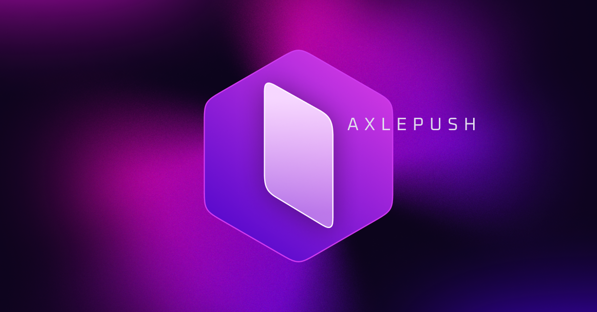

# AxlePUSH

📜 AxlePUSH é um curso online que visa a criação de assets 3D para projetos web. 
Nesse curso, utilizamos a ferramenta Spline, onde você vai conseguir criar objetos, 
interações, animações, cenas, materiais e tudo mais. O 3D abre uma nova porta de 
criatividade, novas possibilidades, novos caminhos, novas experiências.

💡 Basicamente, trata-se de um website que visa aprimorar o entendimento de 
realizar layouts mais entusiastas, alta fidelidade e variedade de animações.
É o projeto mais completo, utiliza de todos os recursos de layout como position,
flexbox, grid system com SASS, GSAP para animações etc.

* HTML5
* JSES6+
* SCSS (https://sass-lang.com/)
* GSAP (https://greensock.com/)
* Spline (https://spline.design/)
* Figma (UI Design) (https://figma.com/)

## 🛠 Instalação

Windows, MacOs ou Linux: É um projeto HTML, CSS e JS puros, basta abrir 
o projeto com algum editor de código e abrir por meio de um servidor simples 
como o LiveServer do VsCode.

## 📈 Implementação do projeto

A implementação do projeto voce pode visualizar clicando aqui >> https://axlepush.com.br/

## 💻 Configuração para Desenvolvimento

Por ser um website feito com as tecnologias nativas suportadas por browsers, 
não é necessário nenhuma configuração para rodar o projeto. Basta que seja aberto 
em um editor de código e um servidor simples. Indico utilizar o VSCode e 
instalar a extensão "Live Server" (https://marketplace.visualstudio.com/items?itemName=ritwickdey.LiveServer) 
para ser criado um servidor local e ter a funcionalidade do reloading ao salvar o projeto.

## 🚀 Contribuição

1. Conheça os outros projetos do curso em FrontPUSH 2.0 (<https://frontpush.com.br>)
2. Veja mais projetos gratuitos no GitHub (<https://github.com/nyousefali>)
3. Veja alguns outros projetos no meu portfólio (<https://nasseryousef.com.br>)
4. Tem alguma dúvida? Me mande uma DM no Instagram (<https://www.instagram.com/nasseryousef__/>)
5. Mais projetos de Design, veja o Dribbble (<https://dribbble.com/nyousefali>)
6. Mais códigos de animações gratuitos? Veja no Codepen (<https://codepen.io/nyousefali>)
7. Muito obrigado por estar aqui! \o/